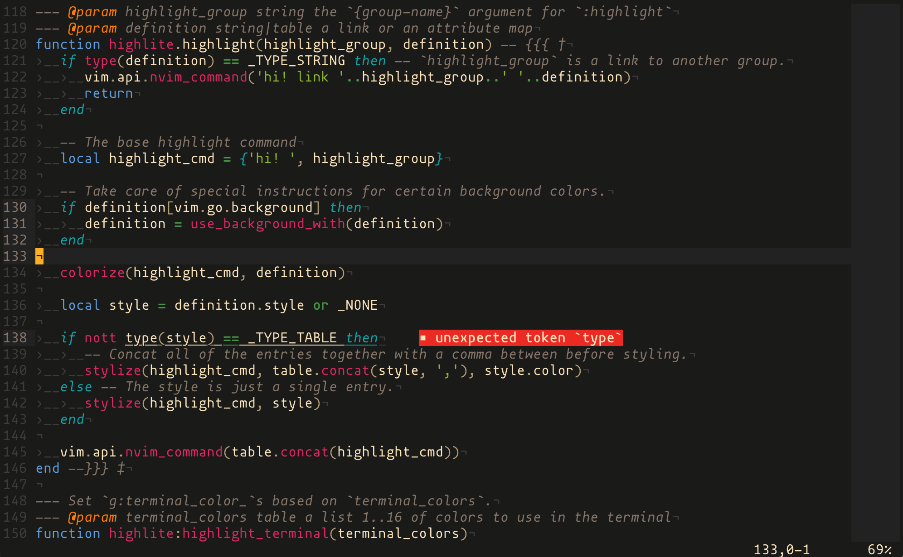

# nvim-srcerite

`nvim-srcerite` is a colorscheme for Neovim, generated from the template colorscheme
[nvim-highlite][1].

It is heavily inspired by [srcery][2], long time my favorite Vim colorscheme.
As its name implies, `nvim-srcerite` is a mix-in of `srcery` and `highlite`: it is intended to
make the best use of `srcery`'s contrasting color palette and `highlite`'s nice syntax highlighting.

<!-- panvimdoc-ignore-start -->



<!-- panvimdoc-ignore-end -->

## Installation

Use your favorite package manager for installation.
More instruction can be found at `nvim-highlite`'s [README][3].

Put the following lines into your `init.lua`.

```lua
vim.opt.termguicolors = true
vim.cmd [[colorscheme srcerite]]
```

As with `nvim-highlite`, Neovim 0.5+ is required.

## Contribution

If you like this colorscheme, don't forget to add star to [nvim-highlite][1]!
Any contributions to this repo are also welcome!


[1]: https://github.com/Iron-E/nvim-highlite
[2]: https://github.com/srcery-colors/srcery-vim
[3]: https://github.com/Iron-E/nvim-highlite/blob/master/README.md#just-the-defaults
